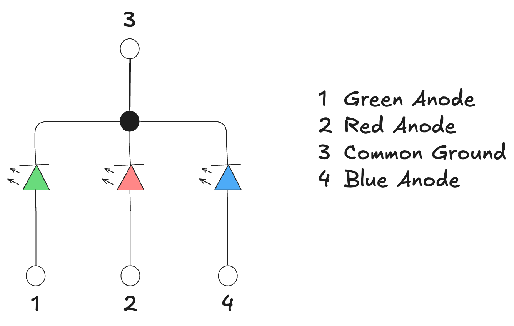
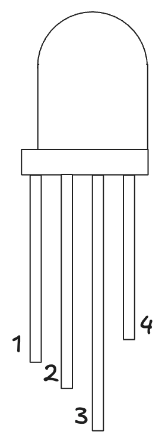
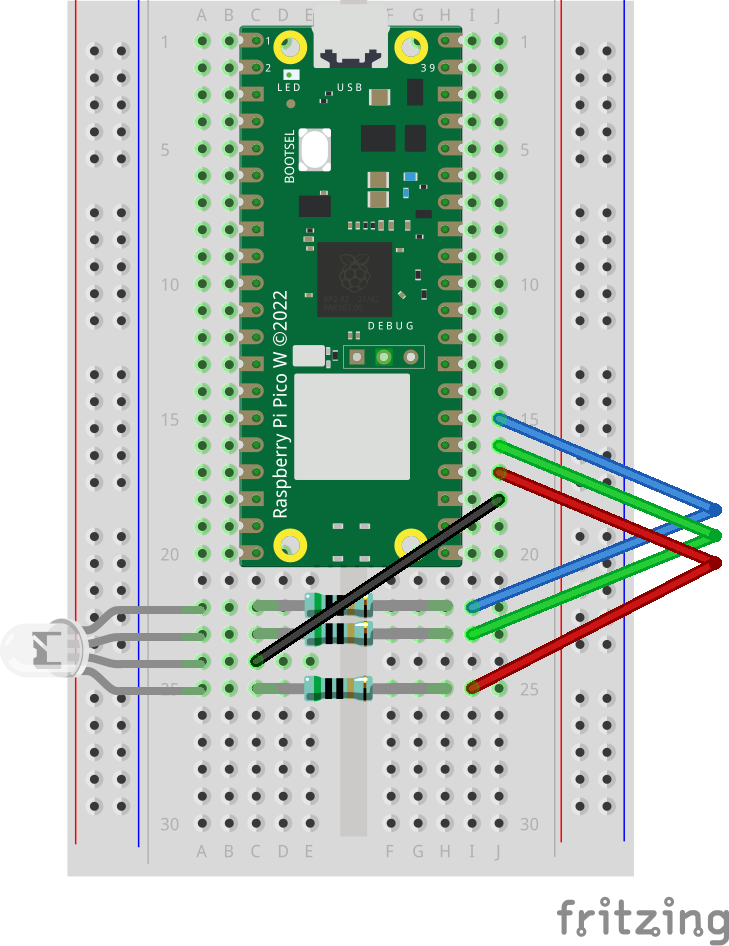

# Your Own "Hello World"

While it sure is nice to see the Pico do something, it is even nicer to see it do something that _you_ told it to do!
In this exercise, your task will be to extend our example program to control the provided multicolor RGB LED instead of the onboard LED we've been making blink on the Pico's PCB.
To do so, you will need to wire up your first, small circuit on the breadboard to connect the LED and the Pico through some resistors.

## Wiring

The multicolor LED has 3 channels: red, green and blue.
You can turn each channel on or off individually by connecting it to a GPIO pin of the Pico 2 and setting that pin to "high", which causes current to flow through the LED that will power the selected channel.
This also means that you can mix colors by giving current to more than one channel simultaneously.

### LED Background

_You may skip this subsection if you are already familiar with LED circuits._

As a schematic, the LED looks like this:

There is one pin per channel, plus a shared pin for connecting back to ground / 0V (this is taken from the [LED's datasheet](https://www.inolux-corp.com/datasheet/Inolux%20Lamp/TH%20Lamp/HV-5RGBXX%205mm%20Full-Color%20Series.pdf), which you can also find in the [`datasheets`](../datasheets) folder in this repository).
We'll wire one output pin of the Pico 2 to each channel with a resistor in between to protect the LED and wire up the LED's ground pin to connect to a Pico 2 pin that exposes the Pico's ground so both parts agree on what 0V means exactly.

Note how the pins / channels of the LED are numbered: pin 1 is green, 2 is red, 3 is ground and 4 is blue.
You can check that you've got the LED the right way round by looking at the bottom end of the pins: pin 3 is longest, while pin 4 is shortest.
This is illustrated on the following diagram:

### Wiring Instructions

The following image shows how to wire up the LED and resistors.

> [!CAUTION]
> Since we're working with real hardware, wiring errors may lead to short-circuits that may damage the electronics.
> For safety, power off the Pico 2 while working on the wiring.
> Check you wiring against the instructions and the pinout before applying power and pay attention to any sign of an electrical fault.
>
> You can find interactive visualizations of the Pico 2 pinout online; I recommend [this one](https://pico2.pinout.xyz/) (turn off all of the checkboxes at the top to see just GPIO and voltage pins).

We're using GPIO pins 18 to 20 for the blue, red and green channel (respectively) and the pin right below them should be labelled ground in the pinout.
If you position the Pico 2 right at the top of the breadboard, you can match the pin numbers against the row numbers on the left-hand side of the board.

> [!IMPORTANT]
> Make sure that the LED is oriented such that its longest leg is on the lower side of the LED, towards the bottom of the breadboard (it should be the second pin from the bottom, the one that doesn't have a resistor).

After placing the resistors and the LED on the breadboard, wire up a connection between the output pins and the resistors and between the two ground pins of the Pico 2 and the LED.
You might need to bend the ends of the pins a little to make them fit into the correct holes on the breadboard.
The resistors are all the same, so don't worry about getting them mixed up - it doesn't matter which resistor goes where.
They can also go in either orientation, just make sure to make the connection within the same row, crossing the gap in the middle of the board.

## Coding

As mentioned in the top-level README, we use the [Embassy framework](https://embassy.dev/) to implement different tasks that we want to run on the Pico 2 (for this exercise, just 1 task / just the `main` function is enough).
Starting from the code provided in `src/main.rs`, have a look at the [Embassy documentation for the RP2350](https://docs.rs/embassy-rp/0.9.0/embassy_rp/) to find out how to represent the hardware we're working with, what methods are available, etc.
Same for the other embassy crates like `embassy_time`.

Your task for this exercise is to adapt the program skeleton to control the LED you just wired up - we want to make it cycle through its 3 channels, i.e., go from red to green to blue to red and so forth.

Hints

Running a cycle every half a second

The starting code already contains a `Ticker` that you can use to wait for the specified time to pass by `.await`ing its `.next()` method.
Have a look at [its documentation](https://docs.rs/embassy-time/latest/embassy_time/struct.Ticker.html) in `embassy_time` to understand how it differs from sleeping for a fixed time.

Turning colors on and off

The starting code already constructs an `Output` pin that you can control, but you'll need to change the underlying `PIN_N` peripheral used to create it to match the new wiring and add additional `Output`s for the other colors (pins 18-20).

Besides using `.toggle()` to flip the `Output` between on and off, you can also use [`set_high`](https://docs.rs/embassy-rp/latest/embassy_rp/gpio/struct.Output.html#method.set_high) or [`set_low`](https://docs.rs/embassy-rp/latest/embassy_rp/gpio/struct.Output.html#method.set_low) to set the pin / color to on or off directly.

