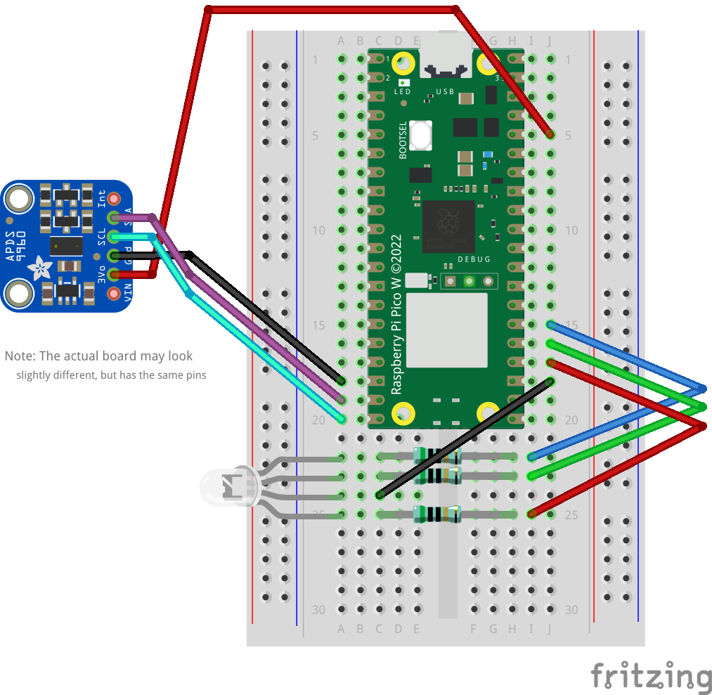

# Making Your Board Detect How Close You Are

Now for something a little more involved: we'll use the provided APDS-9960 light, color and gesture sensor to make the Pico 2 notice your presence. And we'll have it light up the LED as a little traffic light to show you when you start getting too close for comfort.

## Introducing: The APDS-9960

If we want our program to dynamically react to something - such as your presence -, it's no longer enough to rely on the Pico 2's built-in processing hardware.
We need a sensor!
The APDS-9960 sensor, to be exact.

The APDS-9960 is a light sensor that can detect color and motion.
It was used in some of Samsung's S-series phones to do things like figure out if you're holding the phone to your ear and it's worth looking through [the sensor's full datasheet](../datasheets/apds9960.pdf) again after the workshop to find inspiration for what else you can do with the hardware you'll be taking home.

For today, we'll only make use of the sensor's proximity function, which measures the approximate distance of the closest object to the sensor by shooting light at it and measuring if any of it comes back.
The proximity is reported as a value between 0 and 255 (i.e., a `u8`) whose exact interpretation depends on how the sensor was configured (e.g., how much light is emitted to check for reflections) and the composition of the object whose distance is measured (in particular, how much light the object reflects).
Since we don't need an exact distance but only want to know when something gets really close, we won't need to worry about accounting for all of these factors.

## Wiring

We're using a breakout board that already has the sensor and the required wiring soldered on to make it easier for us to connect the Pico 2 to the APDS-9960.
Therefore, there's only 2 things that need wiring up:

1. Supplying power to the sensor in the form of a 3 volt connection, using one wire each for the voltage line and ground and
2. A serial bus for exchanging measurement data and settings between the Pico 2 and the APDS.

The bus also requires 2 wires, for a total of 4 wires to connect all parts of the sensor we will need today.

### Background: The I2C Bus

_You may skip this section if you just want to continue with the workshop exercises - we'll be using a pre-existing library to talk to the APDS sensor, so this section is only for explaining what you are wiring up._

While our Pico 2 is able to connect over WiFi, not all microcontrollers offer this functionality.
It's also quite expensive to run an entire network stack to talk to a sensor that's located right next to the microcontroller on the same board, not to mention that the sensor itself is probably much smaller and would be a lot more pricy if it needed to add WiFi.

Instead, many embedded devices support one of two common serial buses: the _inter-integrated circuit (I2C)_ bus or the _serial peripheral interface (SPI)_ bus.
"Serial" in this context means that the bus is only able to transfer a single byte at a time, transmitting data one bit after the other.

Our APDS sensor is connected over an I2C bus, which uses two wires: one wire transmits a periodic clock signal (called `SCL`) that is used to define when one bit ends and another one starts, the other (called `SDA`) transmits the actual data.
Both SCL and SDA start out as high and are "pulled down" (set to low) to begin a transmission.
A bit is then put on the bus while the clock signal SCL is low and read out on the other end while SCL is high.
The transmission ends if SDA changes from low to high _during_ a transmission window (when SCL is high), returning both lines to their default state.

Timing diagram of an I2C bus transmission

#### I2C Protocol

The first byte of each transmission on the I2C bus contains 7 bits to identify which connected device the message is for (the device _address_) and a single bit to indicate if the following data is a request to read data from the device or a request to write data into it.
This is then followed by a numeric id that uniquely identifies which value to read or write (which values are available under which ids is usually defined in the datasheet of the I2C device).
Depending on the type of transmission (also called "transaction" for I2C buses), after the id either the microcontroller sends the data it wants to write or the I2C device sends the data for which a read was requested.

### Wiring Instructions

The Pico 2 has several ground pins (we've already used one for the LED in the previous exercise) and a single pin that outputs a 3.3V supply voltage.
For the I2C bus, the Pico 2 has two I2C peripherals, meaning that you can use / wire up to two I2C buses simultaneously, but multiple pairs of pins can be used as SCL and SDA for each peripheral so there's a few alternatives if some of the pins are already used for something else.
We will be using the GPIO pins 14 and 15 (the two bottom-most pins on the left-hand side of the Pico 2) for SDA and SCL, respectively.

> [!TIP]
> If you're using the [online Pico 2 pinout](https://pico2.pinout.xyz/) shown in the previous exercise, you can turn on the "I2C" checkbox at the top to see which pins can be used for I2C communication.

The pin right above GPIO 14 is a ground pin that we can use for the ground connection.
Because, as mentioned above, there is only one option to get 3.3V, we need to use the 5th pin from the top on the right side of the Pico 2.
The full wiring should look like the image below:

> [!NOTE]
> We couldn't find a schematic with the exact visuals as our breakout board, so the diagram above shows a slightly different board for the APDS-9960.
> `SDA`, `SCL` and `GND` are the same on our sensors.
> The fourth pin, labelled `3Vo` in the diagram, is labelled `VCC` for us - it's the only one connected to the top-right of the Pico 2 and the only remaining free pin that is part of the same group / side as the other 3 on our APDS board.

## Coding

For this exercise, you'll have to do 4 things:

1. Get access to the I2C bus,
2. Connect to the ADPS-9960 sensor over the I2C bus,
3. Regularly check the sensor's proximity value, and
4. Set the LED to the appropriate color depending on the measurement result.

You'll start from the solution of the previous exercise - we've already added a few imports that you will need to help you get started.

### I2C Setup

All our code is on the Pico 2's side of the bus, so it's all hardware controlled through [`embassy_rp`](https://docs.rs/embassy-rp/0.9.0/embassy_rp/).
Aside from the pins and wires, there is one more thing we will need to work with the bus in an `async` fashion:

#### Interrupts

`embassy_rp` offers two different ways to use a bus: synchronous and asynchronous.
We'll use the asynchronous interface, which means we need to provide the bus driver with a way to wait for incoming data (such as the response to a read request) in addition to providing the pins that are connected to the physical bus / wires.
We do this by declaring that we care about the _interrupt_ that is raised by the Pico 2 when there is new data available.

Use the [`bind_interrupts!` macro](https://docs.rs/embassy-rp/0.9.0/embassy_rp/macro.bind_interrupts.html) from `embassy_rp` to bind the interrupt request (IRQ) for our I2C bus to a handler for the correct I2C bus peripheral.

Hint 1

Since we've wired up our I2C bus to GPIO pins 14 and 15, we're using the `I2C1` peripheral, which therefore needs to be set as the type parameter of the `InterruptHandler`.
You'll have to find the correct interrupt routine for `I2C1` in `embassy_rp::interrupt::typelevel`.

Hint 2

Take a look at the implementation of the `Instance` trait for the `I2C1` peripheral to find the name of the correct interrupt.

#### Bus Driver

With that out of the way, create an async instance of `embassy_rp::i2c::I2c` using the correct pins and other peripherals.
You can use the default I2C [`Config`](https://docs.rs/embassy-rp/0.9.0/embassy_rp/i2c/struct.Config.html) for the last parameter.

Hint 1

You want to use the [`new_async` constructor](https://docs.rs/embassy-rp/0.9.0/embassy_rp/i2c/struct.I2c.html#method.new_async) method on `I2c`.

Hint 2

You'll have to pass the correct peripheral again, as well as the SCL and SDA pins and the name of the struct you created inside `bind_interrupts!`.

### Sensor Setup

Now it's time to connect the actual sensor!
Create an instance of the `Apds9960` driver and use it to initialize the connected sensor.
You can find the documentation of the `apds9960` crate [here](TODO: link APDS docs).

Hint

The sensor initially starts out in a power-saving sleep mode.
You need to call `enable()` on it once to get it to do anything.
You'll also need to separately enable the proximity function.

### Measuring Proximity

Modify the main loop to check if the sensor detects something in its proximity.
Depending on how close the detected object is, have the LED turn on in green first, then switch to yellow as the object comes closer, and finally it should show red if the object is very close.

Hint

Try matching on the result of the sensor's `read_proximity()` method.

Depending on the conditions around you in the room and also the sensor itself, each sensor might report slightly different proximity values for a specific distance.
Feel free to experiment with the exact thresholds a bit to find out what feels right for your sensor.
If you're unsure, it should be a reasonable starting point to detect a presence if the proximity is at least 2, switch to yellow at around 10 and to red at around 200.
