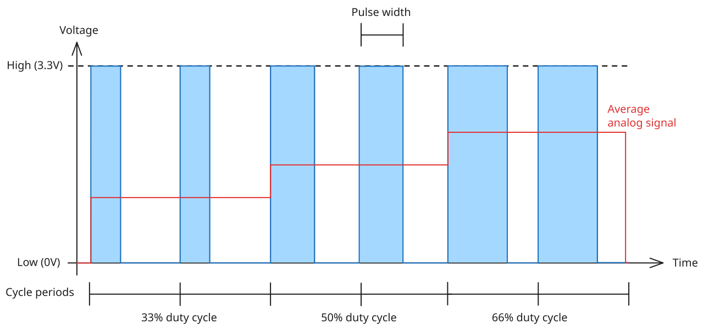

# Going Analog

In this exercise, we will use the APDS-9960 to sense the ambient brightness and make the Pico 2 compensate for the fading light by turning up the brightness of the LED.
Up to now, we only set the color channels of the LED to maximum brightness or turned it off, but it is also possible to make it light up dimmed.

## Wiring

_There are no wiring changes for this exercise._

## Background: Pulse Width Modulation

_You may skip this subsection if you are already familiar with Pulse Width Modulation (PWM)._

In order to dim the LED, we need to supply it with a voltage between GND and VCC.
Unfortunately, we only have a digital output at our disposal that can only output GND or VCC but nothing in between, so we need to get creative.

If the signal on the wire switches between high and low very fast then we can simulate an analog voltage.
This translates to the LED turning on and off so fast that the human eye can't follow and sees the "average brightness".

There are three parameters that define our simulated signal:

1. The _cycle period_ or _cycle frequency_: Specifies how long one high-low cycle takes, either as period or frequency.
2. The _pulse width_: Specifies how long the signal stays high, measured in time.
3. The _duty cycle_: Specifies the percentage amount of the time within a cycle that the pin is high.

Given the cycle period, the pulse width can be used to compute the duty cycle and vice versa.
This signal simulation technique is called "Pulse Width Modulation", abbreviated "PWM", because the pulse widths are modulated to fake an analog signal.

As continuously switching an output pin between high and low is very hard work for the CPU, modern MCUs usually have a dedicated hardware circuit for generating PWM signals.
This so called PWM peripheral consists of multiple channels that each can drive a certain set of GPIO pins.
The PWM peripheral is configured by the program running on the CPU and then starts generating the pulses.

PWM peripherals are complex because they need to support various use cases, from dimming an LED over driving a motor to driving high-quality amplifiers.
To support this wide range of applications they incorporate counters with different modes, comparisons to fixed values etc..
For driving an LED the most simple form usually suffices.

## Coding

For this exercise, you'll have to do 4 things:

1. Setup the PWM channels for driving the LED,
2. Configure the APDS-9960 sensor to read the brightness,
3. Regularly check the sensor's brightness value,
4. Compute the duty cycle from the measurement result and use it to set the LED to the appropriate brightness.

You'll start from a stripped version of the solution of the previous exercise that you can find in `src/main.rs`.

### PWM Setup

The Pi Pico 2 has 12 PWM slices with 2 channels each (a and b respectively).
Look up in the RP2350 datasheet which PWM slices and channels map to the pins controlling the LED (GPIO 18, 19 and 20).
Complete the initialization of the `PwmOutput`s in `main`.

Hint 1

You can find the mapping in the "PWM channels to GPIO pins mapping table" (table 1130 on page 1078) or in the "Main GPIO function table" (table 645 on page 590 ff.).

Hint 2

The mapping is as follows:

| GPIO | PWM slice | PWM channel | PWM slice + channel |
|------|-----------|-------------|---------------------|
|  18  |     1     |      A      |          1A         |
|  19  |     1     |      B      |          1B         |
|  20  |     2     |      A      |          2A         |

Hint 3

As GPIO 18 and 19 share PWM slice 1 they need to be passed to [`Pwm::new_output_ab`](https://docs.embassy.dev/embassy-rp/0.10.0/rp2040/pwm/struct.Pwm.html#method.new_output_ab) with `a` being GPIO 18 and `b` being GPIO 19.

GPIO 20 uses PWM slice 2A and therefore calling [`Pwm::new_output_a`](https://docs.embassy.dev/embassy-rp/0.10.0/rp2040/pwm/struct.Pwm.html#method.new_output_a) is sufficient.

### APDS-9960 Configuration

Check the [`apds9960` crate documentation](https://bjoernlange.github.io/apds9960-rs) on what needs to be enabled in order to detect light.

Hint

You want to use the async variants of the [`enable`](https://bjoernlange.github.io/apds9960-rs/apds9960/struct.Apds9960.html#method.enable-1) and [`enable_light`](https://bjoernlange.github.io/apds9960-rs/apds9960/struct.Apds9960.html#method.enable_light-1) functions.

### Measuring Brightness

Look up how to read the brightness using the [`apds9960` crate documentation](https://bjoernlange.github.io/apds9960-rs) and obtain a brightness value.

Hint

You want to use the async variants of the [`read_light_clear`](https://bjoernlange.github.io/apds9960-rs/apds9960/struct.Apds9960.html#method.read_light_clear-1) function.

### Computing and Using the Duty Cycle

Compute the duty cycle from the brightness value by inverting its value and projecting it into the range accepted by [`PwmOutput::set_duty_cycle_percent`](https://docs.embassy.dev/embassy-rp/0.10.0/rp2040/pwm/trait.SetDutyCycle.html#method.set_duty_cycle_percent).
Then invoke [`PwmOutput::set_duty_cycle_percent`](https://docs.embassy.dev/embassy-rp/0.10.0/rp2040/pwm/trait.SetDutyCycle.html#method.set_duty_cycle_percent) on all three channels.

> [!NOTE]
> If you like then you can also produce a colored light by not driving all three `PwmOutput`s.
> PWM enables usage of the full color spectrum supported by the LED.

> [!TIP]
> LEDs have a non-linear brightness curve when observed by a human eye.
> Increasing the duty cycle from e.g. 10% to 20% will increase the perceived brightness much more than an increse from 80% to 90%.
> Observe the LED at different duty cycles and think of a compensation for that.

Hint 1

Figure out the value range returned by the sensor first and clamp the brightness readings to that value range.
Shadow the sensor with your finger and use a torch (e.g. from your smartphone) for testing.

Hint 2

Projecting the duty cycle to a value range from `[0;1]` and computing the square of it can serve as a simple approximation for smoothing the LED brightness curve.

