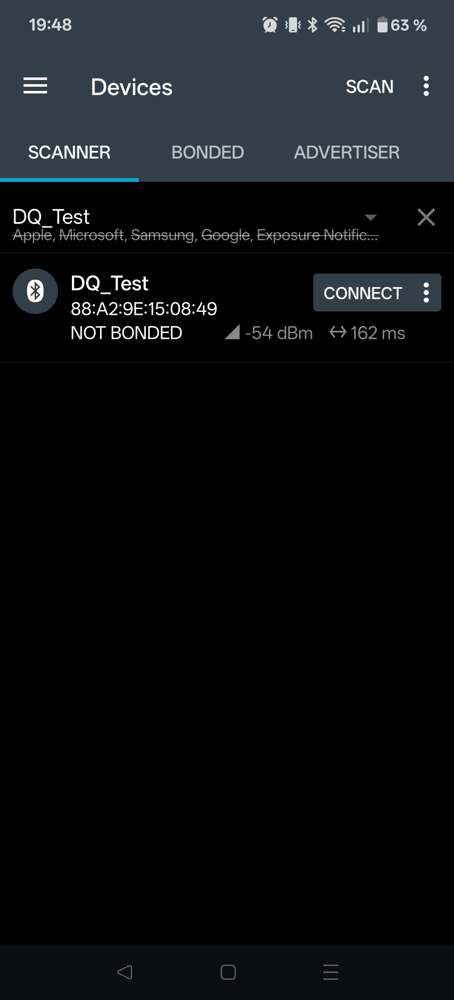
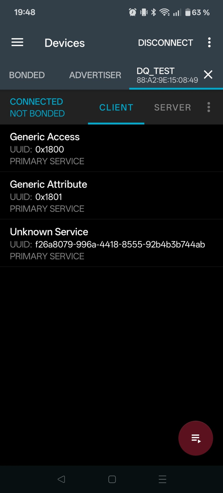
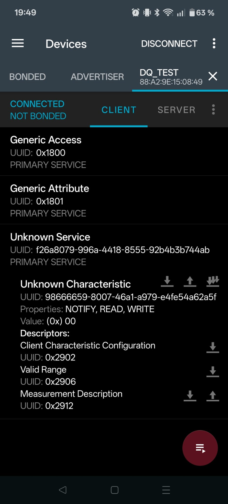
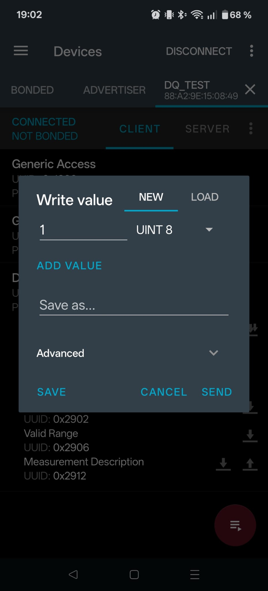

# Bluetooth Low Energy

Most of you have probably used Bluetooth on your phone, PC, headphones, and various other appliances - it's a very widespread protocol for short-range wireless communication (somewhere in the middle between NFC and WiFi depending on configuration).
Naturally, this means that it and particularly its "Low Energy" variant ("BLE") are very useful for embedded devices as well, so in this example we'll extend the Pico 2's connectivity with BLE capabilities, allowing you to read and change the current LED color over Bluetooth in addition to WiFi.

> [!NOTE]
> Like the WiFi example, running this example requires a nightly Rust toolchain (for picoserve's ITAIT routing).

> [!NOTE]
> `trouble-host` 0.7 is pulled from crates.io. Published `cyw43` 0.7.0 still depends on `bt-hci` 0.8, which is incompatible with `trouble-host` 0.7 (`bt-hci` 0.9). This crate therefore patches the Embassy stack from a pinned [git revision](https://github.com/embassy-rs/embassy/commit/c708723686ce80f83c80b059f04446c732db7272) (see `[patch.crates-io]` in `Cargo.toml`). That pulls in `cyw43` with `bt-hci` 0.9 and requires a few API updates in `main.rs` (dual DMA channels, `Cyw43439` chip type on `Runner`) - see the comments there.

## Background: Bluetooth Low Energy

The Bluetooth protocol was introduced in 1998, only a couple of years after than the original version of HTTP/1 ([RFC 1945](https://datatracker.ietf.org/doc/html/rfc1945) or HTTP/1.0), which was published in 1996.
Bluetooth operates over radio waves around 2.4GHz and data is exchanged over a packet-based protocol with a master/slave architecture.
In the terms of the frameworks we will be using today, what we typically think of as a Bluetooth device - the device that we connect to - is called a "peripheral" and the device we connect from (such as a laptop or phone) is called a "central".

Even the original Bluetooth protocol already concerned itself with the energy consumption of Bluetooth devices, but generally expected devices to be continuously connected to each other and exchange data, as is the case with devices like headsets, wireless mice or keyboards, or other devices where the Bluetooth functionality primarily removes the need for them to be wired.
With the advent of ever smaller devices this was no longer sufficient, as they rarely have the need to continuously stream data, and have to consume even less power, especially if they are battery-powered.
Examples for this category are smartwatches, health / fitness trackers, smart home sensors, locks, and tracking beacons ("tags"). 
This led to the development of "Bluetooth Low Energy" ("BLE") as a new Bluetooth protocol focused on energy efficiency.

BLE uses the same radio frequencies as "classic" Bluetooth, which you will see in the code as Bluetooth BR ("basic rate") or EDR ("extended data rate"), and can run side-by-side with it.
However, not all devices have to support both and we will only be working with BLE today.
BLE achieves lower power consumption by two primary means:
First, BLE devices don't need to maintain direct connections to their peers continuously and can spend a lot of their time sleeping between data exchanges.
Second, BLE data can be broadcast without requiring a peer-to-peer connection to exist at all.
In cases where a direct connection has to be established, BLE also allows such a connection to be established faster because only a subset of the overall frequency range is used for this purpose.

### Host Controller Interface

Bluetooth implementations are usually split between a **controller** and a **host**.
You can think of the controller as the hardware components required to implement Bluetooth, such as antennas and components that convert analog radio signals to digital data, while the host is the software or application side of the implementation that handles encoding and decoding and decides what to send to which device when.

Our host implementation is [TrouBLE](https://embassy.dev/trouble/), a BLE implementation for the embassy stack.
TrouBLE can work with any controller that provides an implementation for [`bt_hci`](https://docs.rs/bt-hci/latest/bt_hci/), which the Pico's [CYW43439](https://docs.rs/cyw43/latest/cyw43/) WiFi and Bluetooth chip does.

### Advertisements

For Bluetooth devices to find one another, a Bluetooth connection is established as follows:

1. A peripheral device advertises its presence via specific advertising packets that exist exactly for this purpose,
2. The central scans for advertising packets to find nearby devices,
3. The central connects to a scanned device,
4. A direct channel is opened between the two devices.

#### Packet Format

We'll start by looking at the structure of a BLE packet and work our way down to advertising.
A BLE packet usually contains a small header including an address, a data payload called the "protocol data unit" or PDU, and a CRC checksum to catch transmission errors:

```
| Preamble | Address | Protocol Data Unit (PDU) | CRC Checksum |
|  1 Byte  | 4 Bytes |         2-39 Bytes       |    3 Bytes   |
```

The preamble is a fixed bit pattern that devices can check for to quickly find where a packet starts.
For each pair of devices or broadcast, a unique address is used for all packets that are part of that connection.
Note that this is different from something like a physical / MAC address, which belongs to a distinct device and would be the same for all of this device's connections - here, the address identifies the communication channel between both devices, but the same devices will send packets with different addresses when communicating with other peers.
The PDU, then, contains any dynamic data that might be different between one packet and the next.

Different types of packets have different PDUs.
For advertising, the PDU again consists of a header and a payload.
Here, the header indicates the type of advertisement (more on that below), some flags, and the total length of the payload.

```
|           Header         |               Payload               |
|  Type  |  Flags | Length |                 Data                |
| 4 Bits | 4 Bits | 8 Bits |              0-37 Bytes             |
```

> [!TIP]
> **Types of advertisements**
> The Bluetooth standard distinguishes quite a few different types of advertisements because devices have to indicate together with the advertisement whether one can connect to them or not, if so, whether that is true for everyone or whether they are only advertising to a specific set of peers, and whether they can be scanned for additional information without connecting.
> There are also special advertisement types for advertising on nonstandard frequency channels.
> We will only be using the most simple type of advertisement today, which lets anyone scan and connect to the device.

The payload itself consists of only two things: the device address, which this time around _does_ act like a MAC address and will be the same for all messages from the same device and a list of advertisement data.
We can send as many advertisement data values as we want and can fit into 31 bytes.

```
| Device Address |      Advertisement Data      |
|    6 Bytes     |           0-31 Bytes         |
|                | AD 0 | AD 1 |   ...   | AD N |
```

For each entry / value, we send the following three things:

- The length of the entry (excluding the length field),
- A type tag that identifies the type of value we're sending, and
- The value itself.

The type tags are predefined and refer to fixed quantities like the name of the device, flags, which services a device will offer (see below), etc.

```
| AD Length |  AD Type |    AD Value    |
|   1 Byte  | m Bytes¹ | Length-m Bytes |
```

For example, one of the data sets that we will be sending is the advertising flags, which is always 3 bytes (so length `2`), has the tag `BT_DATA_FLAGS` and a 1-byte bitfield of up to 8 flags.

¹ Most type tags are 1 Byte, but there are some that are longer.

### Profiles

In order to provide a specific functionality through Bluetooth, the peripheral device and central need to agree on a shared interface that assigns semantic meaning to data points exposed by the peripheral and controlled by the central.
For example, for your headphones to act as headphones, they need to somehow tell your phone that they support audio streaming, your phone has to understand how to send audio data, and also how to control the volume of the music being played or read the headphone's battery level.
In the Bluetooth standard, these common interfaces are called **profiles**.

A Bluetooth profile in the most general terms is a specification regarding an aspect of Bluetooth-based wireless communication between devices. 
Profile definitions are based on the Bluetooth Core Specification, but may optionally make use of additional protocols for specific functionality.
Device manufacturers then implement the respective profiles for their devices depending on the intended function of the device.   
There are many specific profiles that the Bluetooth group has defined over the years, such as profiles for audio, imaging, printing, health (e.g, blood pressure), fitness and activity (e.g., heart rate and navigation), and many more.

### GATT

One particularly important profile which we will make use of today is called the "Generic Attribute Profile", or GATT, for short.
As the name implies, GATT allows devices to freely define values and advertise them to other devices connecting to them through a dynamic discovery mechanism instead of a static, pre-defined list of specific values that have to be provided.
The GATT protocol then layers on a client-server model for reading and writing to such "attributes" through generic endpoints that operate on generic ID representations of the attributes.

In GATT terms, a **client** (like your phone) connects to a **server** (like the Pico 2) and sends it GATT commands and requests.
The server receives and processes them and returns a response.
The values / quantities that the client reads or writes are called **characteristics** - in our case, this is the current or intended color of the LED.
Multiple characteristics can be grouped into **services**.
There is also metadata that can be attached to characteristics, such as their allowed value range, name, or unit.
Metadata is optional and each piece of metadata is called a **descriptor**.

Characteristics, services and descriptors are all attributes in GATT and each attribute is tagged with a unique ID for reference.
Usually, full UUIDs are 128 bits, but we'll be using shorter 16-bit IDs which are also supported.
Some IDs are predefined and are always used for specific purposes.
For example, you will see that the Pico 2 will show a "Generic Access" GATT service, which contains the device name and what is called the "appearance", which in our case will indicate that the device is an LED.

#### Notifications & Indications

In addition to reading from or writing to a characteristic, GATT also has support for clients to subscribe to a characteristic and receive updates when its value changes.
If the peripheral waits for an acknowledgement when sending an updated value, this is called an **indication**.
Otherwise, if the value is just broadcast without feedback ("fire & forget"), this is called a **notification**.

### Further Reading

Since we can't possibly cover the entire Bluetooth standard as just one of the parts of this workshop, the above materials cover everything you need to know to get through the exercises, but not everything there is to know about Bluetooth.
If you want to know what we've left out, expand the section below.

<details>

<summary>Left Out</summary>

Here's some further things to search for online:

- Direct communication channels (L2CAP / CoC) & streaming
- Frequency channels, channel hopping, modulation, and advertising channels
- Scan data and extended advertising packets, directed and non-connectable advertisements
- The exact packet format of all of the other packets and the meaning of the other bits and bytes
- Security, pairing, and bonding
- Random and resolvable device IDs
- GATT protocol details and service metadata (discover services, related characteristics, etc.)

If you want to read more about BLE, a good place to start is the Nordic Semiconductor DevAcademy, which hosts an [introductory course](https://academy.nordicsemi.com/courses/bluetooth-low-energy-fundamentals/lessons/lesson-1-bluetooth-low-energy-introduction/topic/what-is-bluetooth-le/) that covers a broad set of topics.

</details>

## Wiring

_There are no wiring changes for this exercise._

## Coding

For this exercise, you'll have to do 6 things:

1. Enable the LED to be controlled by more than 1 source
2. Create a GATT service representing the LED
3. Advertise the LED GATT service via Bluetooth
4. Handle GATT reads of the LED color characteristic
5. Handle GATT writes of the LED color characteristic
6. Add support for subscribing to the LED color characteristic

### Foundations

When we added the HTTP API for setting color values, we introduced some synchronization primitives for communicating LED color changes / requests.
Since we only needed them to send requests from the web server to the LED runner, they can currently only facilitate a single connection.

If we're now keeping the HTTP API and adding Bluetooth on top of it, that is no longer enough.
To enable sending data to the LED runner from an incoming Bluetooth connection, generalize the types in `led_receiver` to more than 1 participant. 
Keep in mind that we're adding both a new sender (incoming Bluetooth writes) _and_ a new receiver for Bluetooth subscriptions / notifications.
Therefore, with keeping WiFi, there are now 2 senders and 2 receivers in total.

Then, initialize the Bluetooth stack from `main` by fixing the `todo!` about calling `ble::initialize` with the correct parameters.

<details>

<summary>Hint</summary>

You may also need to generalize the `LedControllerRunner` and adjust a few callsites.

</details>

### GATT Service Definition

Create a GATT service with a single `u8` characteristic for the LED color.

UUID should be:

- readable
- writable
- support notifications

Initially, the LED will be RED.
Your definition should include a name for the characteristic, as well as the range of valid values.

> [!TIP]
> You can find the TrouBLE documentation on GATT services [here](https://embassy.dev/trouble/#_defining_services).


### Advertisements

- Flags
  - Generally discoverable (will remain discoverable even if no one connects)
  - BR and EDR not supported
- Service UUIDs 
- Name

Allow connect and scan.

### Handling GATT Reads

### Handling GATT Writes

### Notifications

## Testing over Bluetooth

Once your program is running, the Pico 2 W will advertise itself over Bluetooth Low Energy (BLE) under the name you configured — for example **Alice** if you set `BLE_NAME=Alice`.
You can connect to it from your laptop or phone and interact with the LED through GATT characteristics, in addition to the WiFi web server from the previous exercise.

To do so, you will need a so-called _GATT client_ - a small application that can scan for BLE devices, connect to one, browse its services and characteristics, and read from or write to those characteristics.
We recommend installing one before the workshop so you can focus on the exercise itself and will be using the [nRF Connect for Mobile](https://www.nordicsemi.com/Products/Development-tools/nrf-connect-for-mobile) app as our primary testing tool, which is available for free on both [Android](https://play.google.com/store/apps/details?id=no.nordicsemi.android.mcp) and [iOS](https://apps.apple.com/app/nrf-connect-for-mobile/id1054362403).
If you can't use your phone for some reason, please refer to the [section on alternative clients](#alternative-clients).

> ![NOTE]
> This workshop is independently organized and is not affiliated with, sponsored by, or endorsed by Nordic Semiconductor.

### Setting Your Own Device Name

Since everyone in the workshop will be running the same code, by default every Pico would advertise under the same device name, making it hard to tell your device apart from your neighbours'.
To avoid that, before the program will compile you'll need to provide a short unique name through the `BLE_NAME` environment variable when compiling the program.
This value is used directly as the advertised Bluetooth device name — for example, `BLE_NAME=Alice` gives **Alice**, and `BLE_NAME=Table-7` gives **Table-7**.

Pick something you will recognize in the scan list on your laptop or phone.
The name must fit into a single BLE advertisement packet, so keep it to 22 characters or fewer (to understand why this exact number, see [Advertisements](#advertisements)).

Like the WiFi credentials from the previous exercise, export `BLE_NAME` before building or flashing:

```shell
export BLE_NAME=Alice
```

### Using nRF Connect

When the Pico 2 is advertising and ready to accept connections, you should be able to find a device with an advertised name of whatever you set `BLE_NAME` to (e.g., `Alice`) when running a scan with your client:

<div align="center">



<em>Screenshot depicting scanning in the nRF Connect for Mobile app.<br/>The application is intellectual property of Nordic Semiconductor.</em>

</div>

Once your device appears in the device list, connect to it by clicking the `CONNECT` button.
This will open a new tab for the device showing it as a client that displays the available device information:

<div align="center">



<em>Screenshot of a client connection page in the nRF Connect for Mobile app.<br/>The application is intellectual property of Nordic Semiconductor.</em>

</div>

The client should advertise a service with UUID `0x180A`, which is the ID we set in the exercise.
There might be some additional "generic" services listed, which you can safely ignore.
Tapping on the service with this ID expands it to expose the characteristic for the LED with UUID `0x2A57`:

<div align="center">



<em>Screenshot of a BLE service in the nRF Connect for Mobile app.<br/>The application is intellectual property of Nordic Semiconductor.</em>

</div>

You should see that the characteristic supports reading, writing, and notifying.
This is indicated under "properties".
You can read the value by tapping the single down arrow next to the "Digital Output" label.
When tapping the other "single down arrow" buttons, you should be able to see that the characteristic is for the LED color (measurement description) and that the valid value range starts at `0x00` (red) and ends at `0x02` (blue).
Reading the characteristic should return the current LED color as one of those three byte values.

Writing a single byte in that range should change the LED, which you should be able to test by tapping the single up arrow next to "Digital Output" and submitting the value through the pop-up dialog:

<div align="center">



<em>Screenshot of writing a GATT value in the nRF Connect for Mobile app.<br/>The application is intellectual property of Nordic Semiconductor.</em>

</div>

You can send either a `UINT8`, in which case you enter the numeric value, or a `BYTE`, in which case you have to write out the full hexadecimal value (e.g., `01`).
Since the characteristic supports notifications, you should also see updates when the LED color changes through another path (for example, via the WiFi web server) if you tap the button with multiple down arrows to subscribe to the LED value.

#### Troubleshooting

If your device does not show up in the scan list, check that the Pico is powered, your program is running, and Bluetooth is enabled on your phone or laptop (whichever you are using to connect).
You might also need to enable location services on your device, as BLE scanning can expose you to Bluetooth beacons potentially exposing your location, so some OSes don't allow scanning with location info turned off.
Also confirm that you are looking for the name matching the `BLE_NAME` you set when building the firmware, not another device.
Move close to the board and make sure no other application is holding on to the Bluetooth adapter.

If the connection drops immediately after connecting, try power-cycling the Pico.
On Windows, removing a stale pairing for the device and reconnecting often helps.

If a write appears to succeed but the LED does not change, double-check that you are writing exactly one byte with a value of `00`, `01`, or `02`.
Other payloads are rejected by the firmware.

If the advertised name is missing and you only see a device address, look for a peripheral that advertises service UUID `180A`, or power-cycle the Pico and scan again.

### Alternative Clients

If you don't like using or can't use the nRF Connect app, you can use one of the tools listed below.
Unfortunately, there isn't currently a good cross-platform tool that supports everything we need, so please select the appropriate tool for your platform.
We'll try to help you as best as possible with these tools, but the experience might be a little less uniform than with the nRF app.

- **macOS**: [`blew` -- BLE scanner and CLI tool for Mac OS X](https://github.com/stass/blew) (requires xCode to be installed from the app store), or [toolBLEx](https://github.com/emericg/toolBLEx/releases) if you prefer a GUI app (note that you might not be able to test notifications, but should be able to read and write to the LED)
- **Linux**: `gattcat` from [BlueR tools](https://crates.io/crates/bluer-tools), or use `bluetoothctl` directly
- **Windows**: There are [some issues](https://stackoverflow.com/questions/71620883/ble-using-winrt-access-denied-when-executing-getcharacteristicsforuuidasync/71629360#71629360) with Bluetooth on Windows that unfortunately make a lot of apps not work correctly. You can try using [`BLEConsole`](https://github.com/sensboston/BLEConsole) or [toolBLEx](https://github.com/emericg/toolBLEx/releases), but you will probably only be able to read the LED value, not change it.

#### toolBLEx Setup

For testing from your laptop, we recommend [toolBLEx](https://github.com/emericg/toolBLEx/releases), a cross-platform desktop application that uses your computer's built-in Bluetooth adapter.
Download the latest release for your operating system from the project's GitHub releases page:

- **Windows:** `toolBLEx-*-win64.exe` or `.zip`
- **macOS:** `toolBLEx-*-macOS.zip`
- **Linux:** `toolBLEx-*-linux64.AppImage` (or `.tar.gz`)

No extra hardware is required, only a laptop with a working Bluetooth adapter.
Before the exercise, open toolBLEx once and start a scan to confirm that your laptop can see nearby BLE devices.
If the app reports a problem, fix your host Bluetooth setup first (see the troubleshooting section below).

##### Windows

Make sure Bluetooth is turned on in the system settings.
If a connection to the Pico fails, try removing any stale pairing for the board in **Settings → Bluetooth & devices** and connecting again from toolBLEx.
Allow Bluetooth access if Windows prompts you when toolBLEx starts.

##### macOS

On first launch, grant toolBLEx permission to use Bluetooth under **System Settings → Privacy & Security → Bluetooth**.
If macOS blocks the app because it was downloaded from the internet, you may need to right-click the application and choose **Open** once to bypass Gatekeeper.
Note that macOS may show randomly generated device identifiers instead of MAC addresses — identify your Pico by its advertised name rather than by address.

##### Linux

Ensure the Bluetooth service is running (for example, `bluetoothctl show` should report a working adapter).
Your user account typically needs permission to talk to BlueZ; on many distributions this means being a member of the `bluetooth` group, followed by logging out and back in.
If you use the AppImage, make it executable (`chmod +x toolBLEx-*.AppImage`) before running it.

## What's Next

Congratulations!
You've made it to the end of the connectivity path.

If this was the first path you completed, you can switch to the sensing path to learn more about connecting the Pico 2 to other sensors and performing gesture detection - to do so, start [here](../03s-sun-detector/README.md).
Otherwise, or if you prefer to not do more structured learning today, you are free to poke at the APDS-9960, further explore the connectivity features of the Pico 2 or whatever else you want to take a peek at.
If you want some ideas for what you can achieve with just the equipment you have, then for example you could

- Have WiFi and Bluetooth control different aspects of the LED (such as color vs. brightness)
  - Or, if you've done the sensing path, color vs. operating mode or color vs. threshold for distance, gesture detection, etc.
- Learn about Bluetooth security and add authentication for Bluetooth pairing (small tip: while we haven't provided you with any display or buttons, `defmt` log output can be a form of display too...)
- Explore the predefined set of GATT services / profiles. For example, try to build a HID (human interface device) such as a game controller reacting to gestures.

However you decide: We hope that you had a great experience and enjoyed the workshop so far, we are happy to have you here!
We also appreciate feedback, just talk to us!
