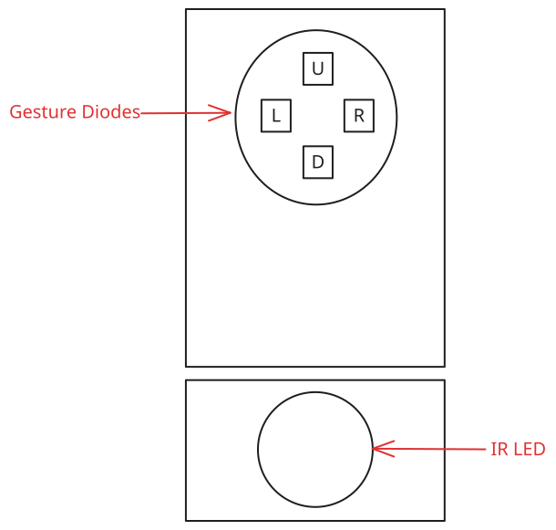

# Finger Pointing

Wouldn't it be great if the Pico 2 could react to you gesturing something?
That's exactly what we will do in this exercise!
We will set up the Pico 2 to read gesture data from the APDS sensor and make the LED change colors if it detects that you swipe your hand horizontally or vertically in front of the sensor.

## Wiring

_There are no wiring changes for this exercise._

## Background: Gesture Sensing with the APDS-9960

The APDS-9960 features four separate diodes for detecting gestures which are facing up (U), down (D), left (L) and right (R). They receive the light emitted by the internal infrared (IR) LED. The following schematic shows the arrangement of the components. For a more detailed description see p.17 of the [datasheet](../datasheets/APDS-9960.md).

Recording data for gesture detection is done by the *Gesture Engine* inside the APDS-9960.
For this exercise we will be using the most basic variant: Constantly collecting gesture data, fetching it from the sensor and deciding whether a gesture was detected or not.

The sensor will start collecting gesture data once gesture sensing and the gesture operating mode have been enabled.
Gesture data is stored in 4-byte-blocks, so called *datasets*, where the first byte is the *up* value, the second the *down* value, the third the *left* value and the fourth the *right* value.
The values represent the intensity of the light received by the diodes, they do not directly resemble gesture directions.
Once a gesture dataset has been obtained, it will be enqueued to a FIFO (first-in first-out) buffer inside the sensor that can be read out via I2C.
The FIFO buffer can hold up to 32 readings and will discard incoming readings if it is full.
Whenever a gesture dataset has been read over I2C then it will be discarded from the FIFO buffer, making room for new readings.

The job of the Pico 2 is to regularly fetch the recorded gesture datasets and determine whether a gesture was made in front of the sensor.
The simplest solution would be to read one gesture dataset at a time, but since the sensor allows reading a larger batch of gesture datasets at once we'd like to make use of that capability.
However, the sensor's FIFO queue will contain a variable number of gesture datasets and we only know that it will be up to 32.
Because we don't have access to the alloc part of the Rust standard library, which contains dynamically sized ("growable") data structures like `Vec`, we need to come up with a different solution that allows for reading multiple datasets.

## Background: `no_std` Memory Management

_You may skip this section if you are already familiar with managing memory in `no_std` Rust._

In order to handle variable-length data, we have a few options in `no_std` Rust:

1. Include a `no_std` compatible allocator to enable use of data structures from `alloc`, e.g. [`linked-list-allocator`](https://crates.io/crates/linked_list_allocator) or [`bumpalo`](https://crates.io/crates/bumpalo) (there are dozens more).
2. Use a data structure designed for `no_std` use that allocates statically or on the stack, e.g. [`heapless`](https://crates.io/crates/heapless).
3. Manually manage memory using statically or stack allocated arrays.

Option 1 would give us access to the entirety of the `alloc` crate while option 2 and 3 are common workarounds that work well if the required amount of memory is known.
All options have their pros and cons:

|                               | Pro                                                                                                    | Con |
|-------------------------------|--------------------------------------------------------------------------------------------------------|-----|
| `alloc` implementation        | Access to all `alloc` datastructures, including growable data structures only limited by available RAM | Monomorphization has a potentially high binary size footprint, out-of-memory panics can occur, additional dependency |
| `no_std` data structure crate | Access to sophisticated datastructures optimized for `no_std` use                                      | Monomorphization has a potentially high binary size footprint, out-of-memory handling required, additional dependency, maximum size needs to be known |
| Arrays                        | Built-in                                                                                               | Out-of-memory handling required, manual bookkeeping of valid data, maximum size needs to be known |

For this exercise, we will go with arrays because:

1. We can name a precise upper bound: `FIFO length` * 4 bytes = 32 * 4 bytes.
2. The `apds9960` crate expects a slice of raw bytes as a destination for the gesture datasets.
3. Interpreting the raw bytes received as gesture datasets is easy.
4. We don't need to hand the data structure around much.

## Background: Extracting Gestures from Gesture Datasets

Now we have everything required to actually look for gestures in the stream of gesture datasets received from the sensor.
In an ideal case, when you wave your hand in front of the sensor then one of the four diodes would start detecting the reflected light from your hand, followed by the other diodes also picking the reflection up.
For example, if you swipe your hand over the sensor from left to right then the left value would increase first, followed by the up and down values and finally the right value.
When your hand starts leaving the sensor's detection area then the left value would fall back to zero, followed by the up and down and finally the right value again.
This pattern needs to be detected, except that we don't care for the direction of the swipe.
However, working with real hardware is unfortunately not as straight forward as just looking for the outlined pattern.

First, the sensor will almost never report a value of zero due to refracted and reflected light from other sources.
There is a certain level of *noise* that we have to account for.
The most common compensation for this is through simple thresholding and ignoring sensor values below the threshold.

Second, measurements tend to *bounce*, meaning that in a series of gesture datasets even if the previous dataset was above the threshold and the current is below the threshold the next one might be above the threshold again, all of this although it is the same gesture.
To avoid unwanted gesture detections this behavior needs to be compensated for by applying so called *debouncing*.
Various debouncing techniques exist, reaching from simple timeouts to machine learning.
A technique that fits this case well works as follows.
It is waited for a gesture dataset that exceeds the threshold.
This event will be considered that a gesture was detected.
Then a timer will be set.
If another gesture dataset that exceeds the threshold arrives within the runtime of the timer then the timer is reset to the original runtime.
If the timer runs out before a gesture dataset arrives that exceeds the threshold then the next gesture dataset exceeding the threshold will be considered a new gesture.
Note that although this simple technique works well for this case it has the downside that, depending on the timer runtime, gestures cannot be detected rapidly.

## Coding

For this exercise, you'll have to do 3 things:

1. Enable gesture detection on the APDS-9960,
2. Read the gesture datasets over I2C and evaluate if they resemble gesture,
3. Implement the main loop which waits for a gesture to be detected and drives the LED.

### Enabling Gesture Detection

Check the [`apds9960` crate documentation](https://bjoernlange.github.io/apds9960-rs) on what needs to be enabled in order to detect gestures and add the appropriate calls in `main`.
Carefully read the gesture sensing background section for further details.

Hint

You want to use the async variants of the [`enable`](https://bjoernlange.github.io/apds9960-rs/apds9960/struct.Apds9960.html#method.enable-1), [`enable_gesture`](https://bjoernlange.github.io/apds9960-rs/apds9960/struct.Apds9960.html#method.enable_gesture-1) and [`enable_gesture_mode`](https://bjoernlange.github.io/apds9960-rs/apds9960/struct.Apds9960.html#method.enable_gesture_mode-1) functions.

### Gesture Evaluation

Implement `GestureDetector::any_gesture_detected`.
First, you will need to read the number of available gesture datasets from the APDS-9960.
Second, you need to read as many gesture datasets as indicated by the sensor into `GestureDetector`'s buffer.
Third, you will need to decide whether the read gesture datasets resemble a gesture.
The `GestureDataset` struct has been prepared to help with this, have a look at it and its functions.

Hint 1

In order to obtain the number of available gesture datasets you want to use the async variant of the [`read_gesture_data_level`](https://bjoernlange.github.io/apds9960-rs/apds9960/struct.Apds9960.html#method.read_gesture_data_level-1) function.

Hint 2

In order to obtain the gesture datasets you want to use the async variant of the [`read_gesture_data`](https://bjoernlange.github.io/apds9960-rs/apds9960/struct.Apds9960.html#method.read_gesture_data-1) function.
You want to pass a slice of `GestureDetector::gesture_datasets` to it.

Hint 3

Make sure to read `gesture_data_level` * **4** bytes as a gesture dataset consists of four bytes.
`gesture_data_level` is the number of available gesture datasets and not the number of available bytes.

Hint 4

Once the raw gesture datasets have been read from the sensor they can be converted to a `GestureDataset` struct instance.
Make sure to do so without needing to store them all at once.

Hint 5

When looking for a gesture, make use of the `GestureDataset::is_noise` function.
If there is at least one gesture dataset that doesn't just contain noise then return `true` from `GestureDetector::any_gesture_detected`.

### Main Loop

Implement the `// TODO` comments in the `loop` at the end of `main`.
Make use of the `GestureDetector::any_gesture_detected` function implemented earlier.
Also have a look at the `LedState` type, it offers everything required to find out how to control the LED and how to proceed through the states of the LED.
Finally, apply the debouncing technique outlined in [Background: Extracting Gestures from Gesture Datasets](#background-extracting-gestures-from-gesture-datasets).

Hint 1

The `GestureDetector::any_gesture_detected` function is exactly what we want to wait for when a new iteration begins.

Hint 2

`LedState::proceed` gives the next state that the LED should transition into and `LedState::get_levels` gives the logic levels that we need to apply to the output pins in order to have the LED color for the state.

Hint 3

For applying debouncing, two things are needed: A timer and a way to detect gestures.
The [`Instant`](https://docs.embassy.dev/embassy-time/git/default/struct.Instant.html) type can be used to implement the timer and  the `GestureDetector::any_gesture_detected` function comes in handy again for gesture detection.

Hint 4

One possible debouncing implementation is to combine checking the [`Instant`](https://docs.embassy.dev/embassy-time/git/default/struct.Instant.html) with repeated calls to `GestureDetector::any_gesture_detected` to ensure there was no gesture during the timer runtime.
Think of a good timer runtime and experiment with different runtimes.

Once you are done, test whether you can cycle through the LED's states by waving your hand in front of the sensor!

## Congratulations

Congratulations!
You made it to the end of the sensing path.

If this was the first path you completed, you can switch to the connectivity path to learn more about wirelessly interacting with the Pico 2 - to do so, start [here](../03c-wifi/README.md).
Otherwise, or if you prefer to not do more structured learning today, you are free to poke at the APDS-9960, explore the connectivity features of the Pico 2 on your own or whatever else you want to take a peek at.
If you want some ideas for what you can achieve with just the equipment you have, then for example you could

- Combine multiple sensor data sources, e.g. only react to gestures close to the sensor.
- Extend on gesture detection: Have different gestures trigger different behavior. Maybe you can even implement some kind of game?
- Improve efficiency: Use the proximity thresholding feature of the APDS-9960 and the gesture engine's interrupt feature to only collect and process gesture datasets if something gets close (advanced).
- Instead of using a raw byte array for receiving gesture datasets use a datastructure, e.g. have a look at the [`heapless`](https://crates.io/crates/heapless) and [`bytemuck`](https://crates.io/crates/bytemuck) crates.

However you decide: We hope that you had a great experience and enjoyed the workshop so far, we are happy to have you here!
We also appreciate feedback, just talk to us!
