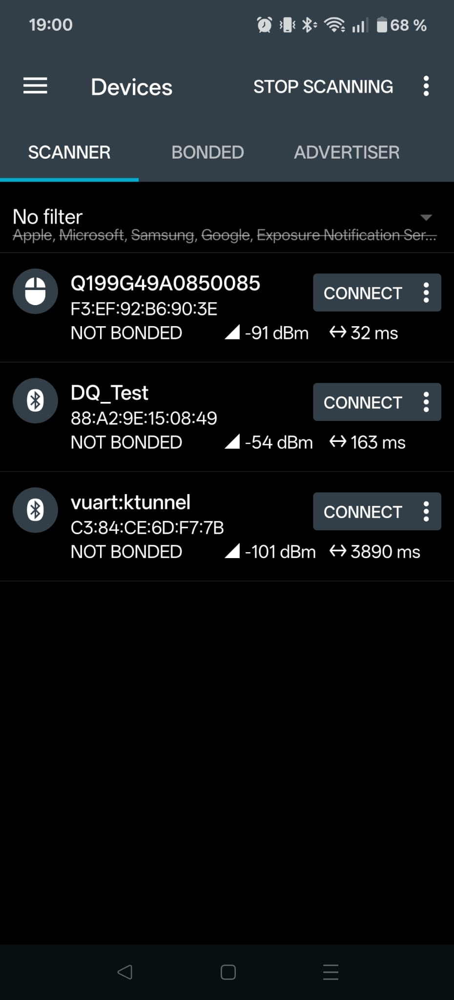
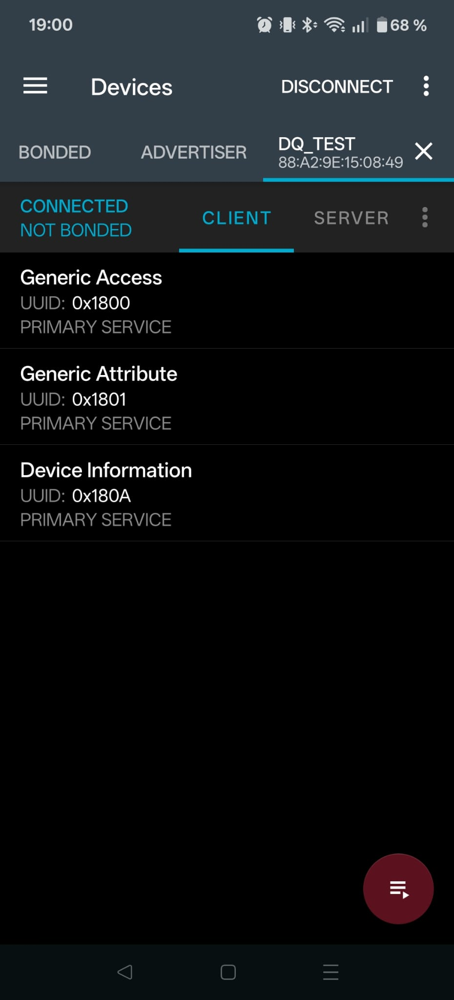
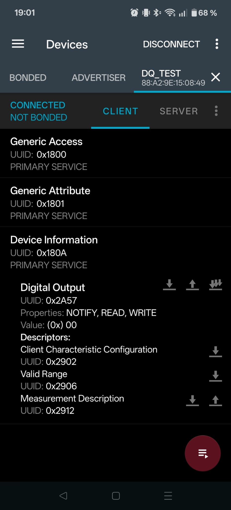

# Bluetooth Low Energy

This example extends the WiFi example with Bluetooth capabilities, allowing you to also read the current LED color and change it over BLE.

> [!NOTE]
> Like the WiFi example, running this example requires a nightly Rust toolchain (for picoserve's ITAIT routing).

> [!NOTE]
> `trouble-host` 0.7 is pulled from crates.io. Published `cyw43` 0.7.0 still depends on `bt-hci` 0.8, which is incompatible with `trouble-host` 0.7 (`bt-hci` 0.9). This crate therefore patches the Embassy stack from a pinned [git revision](https://github.com/embassy-rs/embassy/commit/c708723686ce80f83c80b059f04446c732db7272) (see `[patch.crates-io]` in `Cargo.toml`). That pulls in `cyw43` with `bt-hci` 0.9 and requires a few API updates in `main.rs` (dual DMA channels, `Cyw43439` chip type on `Runner`) - see the comments there.

## Background: Bluetooth Low Energy

TODO

### Advertisements

TODO

## Wiring

TODO

## Coding

TODO

TrouBLE docs: https://embassy.dev/trouble/

## Testing over Bluetooth

Once your program is running, the Pico 2 W will advertise itself over Bluetooth Low Energy (BLE) under the name you configured — for example **Alice** if you set `BLE_NAME=Alice`.
You can connect to it from your laptop or phone and interact with the LED through GATT characteristics, in addition to the WiFi webserver from the previous exercise.

To do so, you will need a so-called _GATT client_ - a small application that can scan for BLE devices, connect to one, browse its services and characteristics, and read from or write to those characteristics.
We recommend installing one before the workshop so you can focus on the exercise itself and will be using the [nRF Connect for Mobile](https://www.nordicsemi.com/Products/Development-tools/nrf-connect-for-mobile) app as our primary testing tool, which is available for free on both [Android](https://play.google.com/store/apps/details?id=no.nordicsemi.android.mcp) and [iOS](https://apps.apple.com/app/nrf-connect-for-mobile/id1054362403).
If you can't use your phone for some reason, please refer to the [section on alternative clients](#alternative-clients).

> ![NOTE]
> This workshop is independently organized and is not affiliated with, sponsored by, or endorsed by Nordic Semiconductor.

### Setting Your Own Device Name

Since everyone in the workshop will be running the same code, by default every Pico would advertise under the same device name, making it hard to tell your device apart from your neighbours'.
To avoid that, before the program will compile you'll need to provide a short unique name through the `BLE_NAME` environment variable when compiling the program.
This value is used directly as the advertised Bluetooth device name — for example, `BLE_NAME=Alice` gives **Alice**, and `BLE_NAME=Table-7` gives **Table-7**.

Pick something you will recognize in the scan list on your laptop or phone.
The name must fit into a single BLE advertisement packet, so keep it to 22 characters or fewer (to understand why this exact number, see [Advertisements](#advertisements)).

Like the WiFi credentials from the previous exercise, export `BLE_NAME` before building or flashing:

```shell
export BLE_NAME=Alice
```

### Using nRF Connect

When the Pico 2 is advertising and ready to accept connections, you should be able to find a device with an advertised name of whatever you set `BLE_NAME` to (e.g., `Alice`) when running a scan with your client:

<div align="center">



<em>Screenshot depicting scanning in the nRF Connect for Mobile app.<br/>The application is intellectual property of Nordic Semiconductor.</em>

</div>

Once your device appears in the device list, connect to it by clicking the `CONNECT` button.
This will open a new tab for the device showing it as a client that displays the available device information:

<div align="center">



<em>Screenshot of a client connection page in the nRF Connect for Mobile app.<br/>The application is intellectual property of Nordic Semiconductor.</em>

</div>

The client should advertise a service with UUID `0x180A`, which is the ID we set in the exercise.
There might be some additional "generic" services listed, which you can safely ignore.
Tapping on the service with this ID expands it to expose the characteristic for the LED with UUID `0x2A57`:

<div align="center">



<em>Screenshot of a BLE service in the nRF Connect for Mobile app.<br/>The application is intellectual property of Nordic Semiconductor.</em>

</div>

You should see that the characteristic supports reading, writing, and notifying.
This is indicated under "properties".
You can read the value by tapping the single down arrow next to the "Digital Output" label.
When tapping the other "single down arrow" buttons, you should be able to see that the characteristic is for the LED color (measurement description) and that the valid value range starts at `0x00` (red) and ends at `0x02` (blue).
Reading the characteristic should return the current LED color as one of those three byte values.

Writing a single byte in that range should change the LED, which you should be able to test by tapping the single up arrow next to "Digital Output" and submitting the value through the pop-up dialog:

<div align="center">


<em>Screenshot of writing a GATT value in the nRF Connect for Mobile app.<br/>The application is intellectual property of Nordic Semiconductor.</em>

</div>

You can send either a `UINT8`, in which case you enter the numeric value, or a `BYTE`, in which case you have to write out the full hexadecimal value (e.g., `01`).
Since the characteristic supports notifications, you should also see updates when the LED color changes through another path (for example, via the WiFi webserver) if you tap the button with multiple down arrows to subscribe to the LED value.

#### Troubleshooting

If your device does not show up in the scan list, check that the Pico is powered, your program is running, and Bluetooth is enabled on your phone or laptop (whichever you are using to connect).
You might also need to enable location services on your device, as BLE scanning can expose you to Bluetooth beacons potentially exposing your location, so some OSes don't allow scanning with location info turned off.
Also confirm that you are looking for the name matching the `BLE_NAME` you set when building the firmware, not another device.
Move close to the board and make sure no other application is holding on to the Bluetooth adapter.

If the connection drops immediately after connecting, try power-cycling the Pico.
On Windows, removing a stale pairing for the device and reconnecting often helps.

If a write appears to succeed but the LED does not change, double-check that you are writing exactly one byte with a value of `00`, `01`, or `02`.
Other payloads are rejected by the firmware.

If the advertised name is missing and you only see a device address, look for a peripheral that advertises service UUID `180A`, or power-cycle the Pico and scan again.

### Alternative Clients

If you don't like using or can't use the nRF Connect app, you can use one of the tools listed below.
Unfortunately, there isn't currently a good cross-platform tool that supports everything we need, so please select the appropriate tool for your platform.
We'll try to help you as best as possible with these tools, but the experience might be a little less uniform than with the nRF app.

- **macOS**: [`blew` -- BLE scanner and CLI tool for Mac OS X](https://github.com/stass/blew) (requires xCode to be installed from the app store), or [toolBLEx](https://github.com/emericg/toolBLEx/releases) if you prefer a GUI app (note that you might not be able to test notifications, but should be able to read and write to the LED)
- **Linux**: `gattcat` from [BlueR tools](https://crates.io/crates/bluer-tools), or use `bluetoothctl` directly
- **Windows**: There are [some issues](https://stackoverflow.com/questions/71620883/ble-using-winrt-access-denied-when-executing-getcharacteristicsforuuidasync/71629360#71629360) with Bluetooth on Windows that unfortunately make a lot of apps not work correctly. You can try using [`BLEConsole`](https://github.com/sensboston/BLEConsole) or [toolBLEx](https://github.com/emericg/toolBLEx/releases), but you will probably only be able to read the LED value, not change it.

#### toolBLEx Setup

For testing from your laptop, we recommend [toolBLEx](https://github.com/emericg/toolBLEx/releases), a cross-platform desktop application that uses your computer's built-in Bluetooth adapter.
Download the latest release for your operating system from the project's GitHub releases page:

- **Windows:** `toolBLEx-*-win64.exe` or `.zip`
- **macOS:** `toolBLEx-*-macOS.zip`
- **Linux:** `toolBLEx-*-linux64.AppImage` (or `.tar.gz`)

No extra hardware is required, only a laptop with a working Bluetooth adapter (if your laptop doesn't have bluetooth and you also don't have an adapter, you can try using [your phone with a mobile app](#alternative-clients) instead).

> [!TIP]
> If you prefer using a terminal tool, you can find some under [alternatives](#alternative-clients) as well.

Before the exercise, open toolBLEx once and start a scan to confirm that your laptop can see nearby BLE devices.
If the app reports a problem, fix your host Bluetooth setup first (see the troubleshooting section below).

##### Windows

Make sure Bluetooth is turned on in the system settings.
If a connection to the Pico fails, try removing any stale pairing for the board in **Settings → Bluetooth & devices** and connecting again from toolBLEx.
Allow Bluetooth access if Windows prompts you when toolBLEx starts.

##### macOS

On first launch, grant toolBLEx permission to use Bluetooth under **System Settings → Privacy & Security → Bluetooth**.
If macOS blocks the app because it was downloaded from the internet, you may need to right-click the application and choose **Open** once to bypass Gatekeeper.
Note that macOS may show randomly generated device identifiers instead of MAC addresses — identify your Pico by its advertised name rather than by address.

##### Linux

Ensure the Bluetooth service is running (for example, `bluetoothctl show` should report a working adapter).
Your user account typically needs permission to talk to BlueZ; on many distributions this means being a member of the `bluetooth` group, followed by logging out and back in.
If you use the AppImage, make it executable (`chmod +x toolBLEx-*.AppImage`) before running it.

