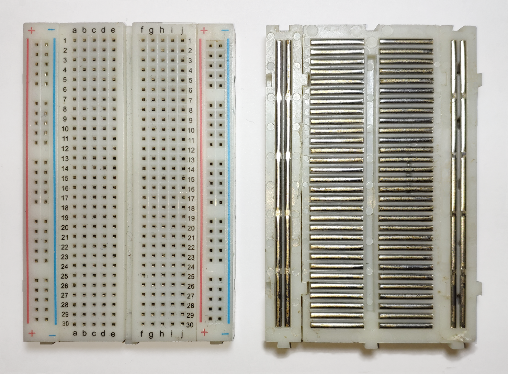

# Rust Dortmund Embedded Workshop

This workshop contains a series of exercises about starting to write embedded Rust with [`embassy`](https://embassy.dev/) targeting the the Raspberry Pi Pico 2.
Each subfolder in this repository contains one exercise.
Exercises are numbered and build upon another both in terms of code and in difficulty, so doing them in order will be easiest.
If you're new to embedded Rust or want to brush up your knowledge, there is a recording of a Rust Dortmund meetup talk giving a broad introduction to the topic that you can find [here](https://www.youtube.com/watch?v=BXjcAf0Z95Q).

There are hints for most exercises inside the README instructions for each subfolder to help you along the way.
Make sure to browse the rendered instructions and not the raw markdown files if you don't want to be spoiled.

Except for the first exercise, which doesn't yet involve any coding, the source code for each crate under `src` is intended as a starting point for the respective exercise.
Often times, this starting point will match a working solution of the previous exercise, in which case you are free to choose between using the example solution or continuing with a copy of your own previous solution.

Each exercise contains an example solution under its `example` folder that you can look at if you get stuck.
Since there are multiple ways to achieve the exercises' tasks, these solutions may not always match how your code is structured, but you can always compare against a previous example solution to see what has changed.
Note that the example solutions are separate crates and can't be run as a `cargo run --example`, but you can switch to the `example` folder and run `cargo run --release` to try them out.

## Prerequisites

- Bring your own laptop.
- You will connect to the hardware over two USB-A cables. If your laptop doesn't have 2 USB-A ports, you might need to bring additional adapters.
  - One of the USBs is only for providing power to the microcontroller. You may substitute power from your laptop by bringing a phone charger with a USB-A socket.
  - The other cable is used to program the microcontroller and definitely needs to go into your laptop. If your laptop doesn't have USB-A ports at all, please bring a matching adapter (e.g., to USB-C if that's what your laptop has).
- Clone this repo 
- Follow as much of the setup instructions under [`00-setup`](00-setup/README.md) as you want that don't yet require course hardware to prepare.

## Embassy

You will be using the [embassy](https://embassy.dev/) framework to write your programs during this workshop.
Embassy is a task framework for embedded Rust, which essentially means that it allows you to write multiple independent program tasks that the microcontroller will then run concurrently.
This is useful if, for example, you want to regularly update some output value (say, the color of an LED), but at the same time you want to check or wait for a new input value (e.g., a new sensor reading or an API request).

The provided code skeletons will help you along with how embassy works, but for more concrete hardware interactions (like turning on the LED) you will need to look at the documentation for the relevant types from [`embassy-rp`](https://docs.rs/embassy-rp/latest/embassy_rp/index.html).
If you prefer to get a little bit of a head start upfront, there is a recording of a Rust Dortmund meetup talk about embassy that you can find [here](https://www.youtube.com/watch?v=zsanJhEiiCE).

## Working with a Breadboard

Over the course of the workshop, you will wire up different components to the Pico 2 to be able to control them from your code.
To do so, you'll work on a so-called _breadboard_, an electrical board with multiple rows that has a grid of holes that you can insert pins into to connect different pieces of hardware without needing to solder anything together.

The breadboard internally connects some of the inserted pins electrically to reduce the amount of wires required to assemble a circuit:
a connection is made between all pins connected to the same `+` or `-` column (within the column, not from `+` to `-`).
Additionally, all pins within the same half of each numbered row are connected, but the left and right halves of each row are separate:

Breadboard Internals.
By <a href="https://commons.wikimedia.org/w/index.php?title=User:Guhuru" class="new" title="User:Guhuru (page does not exist)">Guhuru</a> - Own work, <a href="http://creativecommons.org/publicdomain/zero/1.0/deed.en" title="Creative Commons Zero, Public Domain Dedication">CC0</a>, <a href="https://commons.wikimedia.org/w/index.php?curid=97240411">Link</a>

## License and Attributions

The presentation framework RevealJS used to create the introduction slides is licensed under an MIT license (see [LICENSE-RevealJS](000-intro/LICENSE-RevealJS)).

The logo from awesome embedded Rust is licensed under the [CC0 1.0 Universal License](https://creativecommons.org/publicdomain/zero/1.0/legalcode).
