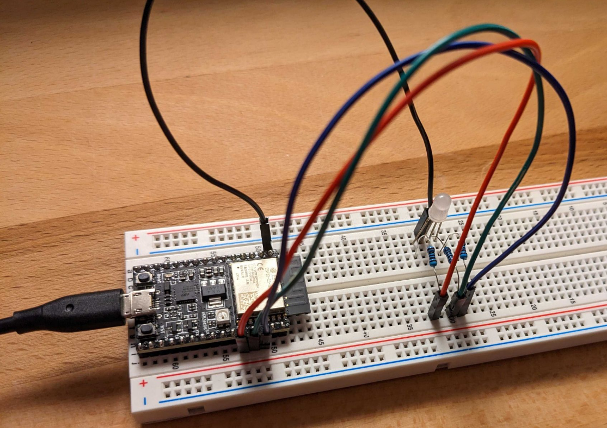

# ESP32C3 WiFi and BLE controlled LED

This example shows how the color of a blinking RGB LED can be controlled via WiFi and BLE.

## Setup



Connect an RGB LED to the ESP32C3 on a breadboard.
Use resistors between the pins and the LED, one for each color.
Connect the red LED to pin 3, the green LED to pin 2 and the blue LED to pin 1.
Connect ground.


## Setting the LED color

Once the board is running the LED color can be set over WiFi using

```
curl -X POST -v http://<ip>/color/<color>
```

where `color` is either `red`, `green` or `blue`.

It is also possible to set the color over BLE using

```
bluetoothctl
scan on
<find the BLE MAC>
connect <MAC>
menu gatt
list-attributes
<find the attribute for the characteristic>
select-attribute <uuid>
# Set color, 0 = red, 1 = green, 2 = blue
write <data>
# Get color
read
```